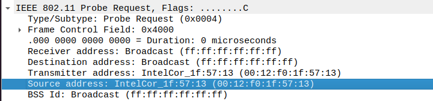
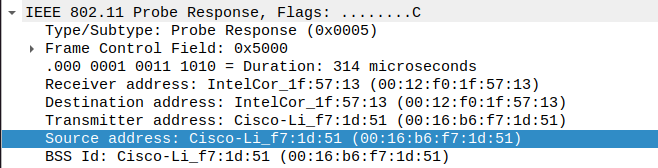

1. What are the SSIDs of the two access points that are issuing most of the beacon
frames in this trace? 

30 Munroe St. ; linksys12

2. What are the intervals of time between the transmissions of the beacon frames the
linksys_ses_24086 access point? From the 30 Munroe St. access point? (Hint: this
interval of time is contained in the beacon frame itself).

linksys12: 0.10204 s
30 Munroe St. : 0.10204 s

3. -5  What (in hexadecimal notation) is the source MAC address on the beacon frame
from 30 Munroe St? Recall from Figure 7.13 in the text that the source,
destination, and BSS are three addresses used in an 802.11 frame. For a detailed
discussion of the 802.11 frame structure, see section 7 in the IEEE 802.11
standards document (cited above).

00:16:b6:f7:1d:51
ff:ff:ff:ff:ff:ff
00:16:b6:f7:1d:51

6. The beacon frames from the 30 Munroe St access point advertise that the access
point can support four data rates and eight additional “extended supported rates.”
What are these rates?

Rates of data transmission

7. Find the 802.11 frame containing the SYN TCP segment for this first TCP session
(that downloads alice.txt). What are three MAC address fields in the 802.11 frame? Which MAC address in this frame corresponds to the wireless host (give
the hexadecimal representation of the MAC address for the host)? To the access
point? To the first-hop router? What is the IP address of the wireless host
sending this TCP segment? What is the destination IP address? Does this
destination IP address correspond to the host, access point, first-hop router, or
some other network-attached device? Explain

__Wireless host__ 91:2a:b0:49:b6:4f 
__AP__ 00:16:b6:f7:1d:51
__Router__ 00:16:b6:f4:eb:a8

__Destination IP__ 128.119.245.12
__SOurce IP__ 192.168.1.109

The Source IP is the first hop router. 

8. Find the 802.11 frame containing the SYNACK segment for this TCP session.
What are three MAC address fields in the 802.11 frame? Which MAC address in
this frame corresponds to the host? To the access point? To the first-hop router?
Does the sender MAC address in the frame correspond to the IP address of the
device that sent the TCP segment encapsulated within this datagram? (Hint:
review Figure 6.19 in the text if you are unsure of how to answer this question, or
the corresponding part of the previous question. It’s particularly important that
you understand this).

__Wireless host__ 91:2a:b0:49:b6:4f 
__AP__ 00:16:b6:f7:1d:51
__Router__ 00:16:b6:f4:eb:a8

No. The senter corresponds to the 802.11 protocol, which encapsulates the IP source, which is the server requested

9. What two actions are taken (i.e., frames are sent) by the host in the trace just after
t=49, to end the association with the 30 Munroe St AP that was initially in place
when trace collection began? (Hint: one is an IP-layer action, and one is an
802.11-layer action). Looking at the 802.11 specification, is there another frame
that you might have expected to see, but don’t see here?

DHCP Release -> frees an IP Address
Deauthentication 

10. Examine the trace file and look for AUTHENICATION frames sent from the host
to an AP and vice versa. How many AUTHENTICATION messages are sent
from the wireless host to the linksys_ses_24086 AP (which has a MAC address of
Cisco_Li_f5:ba:bb) starting at around t=49? .

4 AUTHENTICATION

11. Does the host want the authentication to require a key or be open?

0 Open System

12. Do you see a reply AUTHENTICATION from the linksys_ses_24086 AP in the
trace?

No. Maybe require authentication

13. Now let’s consider what happens as the host gives up trying to associate with the
linksys_ses_24086 AP and now tries to associate with the 30 Munroe St AP. Look
for AUTHENICATION frames sent from the host to and AP and vice versa. At
what times are there an AUTHENTICATION frame from the host to the 30
Munroe St. AP, and when is there a reply AUTHENTICATION sent from that AP
to the host in reply? (Note that you can use the filter expression “wlan.fc.subtype
== 11and wlan.fc.type == 0 and wlan.addr == IntelCor_d1:b6:4f” to display only
the AUTHENTICATION frames in this trace for this wireless host.)

14. An ASSOCIATE REQUEST from host to AP, and a corresponding ASSOCIATE
RESPONSE frame from AP to host are used for the host to associated with an AP.
At what time is there an ASSOCIATE REQUEST from host to the 30 Munroe St
AP? When is the corresponding ASSOCIATE REPLY sent? (Note that you can
use the filter expression “wlan.fc.subtype < 2 and wlan.fc.type == 0 and
wlan.addr == IntelCor_d1:b6:4f” to display only the ASSOCIATE REQUEST
and ASSOCIATE RESPONSE frames for this trace.)

15. What transmission rates is the host willing to use? The AP? To answer this
question, you will need to look into the parameters fields of the 802.11 wireless
LAN management frame.

__Active scanning, stations still go through each channel in turn, but instead of passively listening to the signals on that frequency, station send a Probe Request management frame asking what network is available on that channel.

Probe Request are sent to the broadcast DA address (ff:ff:ff:ff:ff:ff). Once a Probe sent, STA starts a ProbeTimer countdown & wait for answers. At the end of the timer, STA process the answer it has received. If no answers received, STA moves to next channel & repeats the discovery process.

STA sending Probe Request may specify the SSID they looking (called directed probe request). Then only IBSS STA or AP support that SSID will answer. The SSID value can also be set to 0 (ie SSID field is present, but empty). This is called Wildcard SSID or Null Probe Request.__ 
