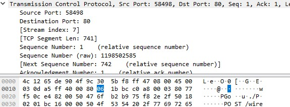
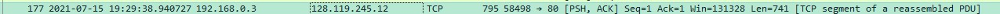

1) What is the IP address and TCP port number used by the client computer (source) that is transferring the alice.txt file to gaia.cs.umass.edu?  To answer this question, it’s probably easiest to select an HTTP message and explore the details of the TCP packet used to carry this HTTP message, using the “details of the selected packet header window” (refer to Figure 2 in the “Getting Started with Wireshark” Lab if you’re uncertain about the Wireshark windows).

The IP Address of source is 192.168.0.3 and port is 80

2) What is the IP address of gaia.cs.umass.edu? On what port number is it sending and receiving TCP segments for this connection?

128.119.245.12. TCP Port: 80 to send and source 65290

3)What is the sequence number of the TCP SYN segment that is used to initiate the TCP connection between the client computer and gaia.cs.umass.edu? (Note: this is the “raw” sequence number carried in the TCP segment itself; it is NOT the packet # in the “No.” column in the Wireshark window.  Remember there is no such thing as a “packet number” in TCP or UDP; as you know, there are sequence numbers in TCP and that’s what we’re after here.  Also note that this is not the relative sequence number with respect to the starting sequence number of this TCP session.). What is it in this TCP segment that identifies the segment as a SYN segment? Will the TCP receiver in this session be able to use Selective Acknowledgments (allowing TCP to function a bit more like a “selective repeat” receiver, see section 3.4.5 in the text)?

Relative Sequence Number is 0 and raw 2484728423
The last bit of the flag identifies as SYN segment.
I think not? should read when correct

4) What is the sequence number of the SYNACK segment sent by gaia.cs.umass.edu to the client computer in reply to the SYN? What is it in the segment that identifies the segment as a SYNACK segment? What is the value of the Acknowledgement field in the SYNACK segment? How did gaia.cs.umass.edu determine that value? 

Raw sequence number is 300029385
Flag identifies as SYNACK segment
8th bit determines as SYN. ACK field in SYNACK is 2427008197. I think is the last sequence number + bytes in the last segment

5) What is the sequence number of the TCP segment containing the header of the HTTP POST command?  Note that in order to find the POST message header, you’ll need to dig into the packet content field at the bottom of the Wireshark window, looking for a segment with the ASCII text “POST” within its DATA field,.  How many bytes of data are contained in the payload (data) field of this TCP segment? Did all of the data in the transferred file alice.txt fit into this single segment?

741 bytes. No, the next packets also contain data of the file

6) Consider the TCP segment containing the HTTP “POST” as the first segment in the data transfer part of the TCP connection.  
- At what time was the first segment (the one containing the HTTP POST) in the data-transfer part of the TCP connection sent?  
- At what time was the ACK for this first data-containing segment received?  
- What is the RTT for this first data-containing segment? 
- What is the RTT value the second data-carrying TCP segment and its ACK? 
- What is the EstimatedRTT value (see Section 3.5.3, in the text) after the ACK for the second data-carrying segment is received? Assume that in making this calculation after the received of the ACK for the second segment, that the initial value of EstimatedRTT is equal to the measured RTT for the first segment, and then is computed using the EstimatedRTT equation on page 242, and a value of α = 0.125.
Note: Wireshark has a nice feature that allows you to plot the RTT for each of the TCP segments sent.  Select a TCP segment in the “listing of captured packets” window that is being sent from the client to the gaia.cs.umass.edu server.  Then select: Statistics->TCP Stream Graph->Round Trip Time Graph.

The first segment was sent 2021-07-15 19:29:38.940727
The ACK for this segment (number of bytes of the first segment plus one) 
was received at 19:29:39.118249

__RTT = 0.177522__

